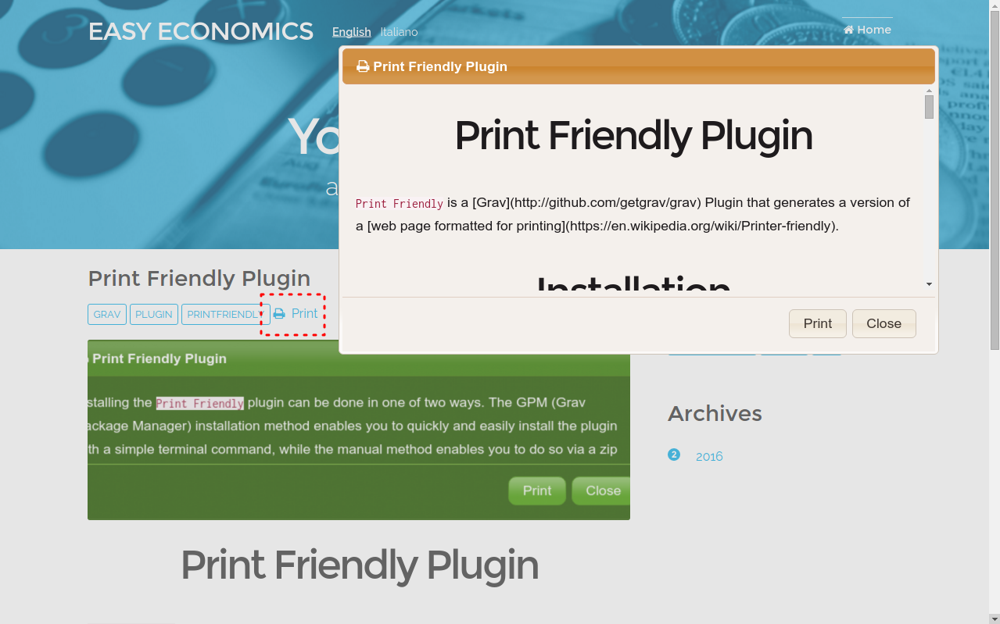

# Print Friendly Plugin



`Print Friendly` is a [Grav](http://github.com/getgrav/grav) Plugin that generates a version of a [web page formatted for printing](https://en.wikipedia.org/wiki/Printer-friendly).

# Installation

Installing the `Print Friendly` plugin can be done in one of two ways. The GPM (Grav Package Manager) installation method enables you to quickly and easily install the plugin with a simple terminal command, while the manual method enables you to do so via a zip file.

## GPM Installation (Preferred)

The simplest way to install this plugin is via the [Grav Package Manager (GPM)](http://learn.getgrav.org/advanced/grav-gpm) through your system's Terminal (also called the command line).  From the root of your Grav install type:

    bin/gpm install printfriendly

This will install the `Print Friendly` plugin into your `/user/plugins` directory within Grav. Its files can be found under `/your/site/grav/user/plugins/printfriendly`.

## Manual Installation

To install this plugin, just download the zip version of this repository and unzip it under `/your/site/grav/user/plugins`. Then, rename the folder to `printfriendly`. You can find these files either on [GitHub](https://github.com/iusvar/grav-plugin-printfriendly) or via [GetGrav.org](http://getgrav.org/downloads/plugins#extras).

You should now have all the plugin files under

    /your/site/grav/user/plugins/printfriendly

# Updating

As development for the `Print Friendly` plugin continues, new versions may become available that add additional features and functionality, improve compatibility with newer Grav releases, and generally provide a better user experience. Updating `Print Friendly` is easy, and can be done through Grav's GPM system, as well as manually.

## GPM Update (Preferred)

The simplest way to update this plugin is via the Grav Package Manager (GPM). You can do this with this by navigating to the root directory of your Grav install using your system's Terminal (also called command line) and typing the following:

    bin/gpm update printfriendly

This command will check your Grav install to see if your `Print Friendly` plugin is due for an update. If a newer release is found, you will be asked whether or not you wish to update. To continue, type y and hit enter. The plugin will automatically update and clear Grav's cache.

## Manual Update

Manually updating `Print Friendly` is pretty simple. Here is what you will need to do to get this done:

* Delete the `your/site/user/plugins/printfriendly` directory.

* Downalod the new version of the Print Friendly plugin from either [GitHub](https://github.com/iusvar/grav-plugin-printfriendly) or [GetGrav.org](http://getgrav.org/downloads/plugins#extras).

* Unzip the zip file in `your/site/user/plugins` and rename the resulting folder to `printfriendly`.

* Clear the Grav cache. The simplest way to do this is by going to the root Grav directory in terminal and typing `bin/grav clear-cache`.

Note: Any changes you have made to any of the files listed under this directory will also be removed and replaced by the new set. Any files located elsewhere (for example a YAML settings file placed in `user/config/plugins`) will remain intact.

# Usage

To use this plugin, you simplest way to display the link to print is to use the Twig function and pass it a dynamic value such as:

```
{{ printfriendly(page.route) }}
```

This will use the current page's route as the unique identifier.

The `Print Friendly` plugin comes with some sensible default configuration, that are pretty self explanatory:

## Config Defaults

```yaml
# Global plugin configurations.
enabled: true               # Set to false to disable this plugin completely.
built_in_css: true          # Use built-in CSS of the plugin.

# jQuery user interface library.
jqueryui:
  source: maxcdn            # Set source between your server or MaxCDN.
  version: 1.12.0           # Set version.
  themes: start             # Set theme for window.

# Window size.
window:
  width: 50                 # A percentage of the maximum size of the device width.
  height: 40                # A percentage of the maximum size of the device height.

# Font Awesome, the iconic font and CSS framework.
awesome:
  use_font: false           # Set true to use the library.
  icon: print               # Choose icon if the library is enabled.
  link_label: both          # It allows you to see both icon and text.

# Some items you can include in printing.
metadata:
  use_image: true           # It refers to the first image in the folder.
                            # However, all images including the first are printed if the img tag is present in allowed_tags.
  use_title: true
  use_author: true
  use_date: false
  use_tags: false

# The strip_tags function delete from a html document all tags except those listed.
# You can add or delete tags elements.
tags:
  allowed_tags:
    - a
    - b
    - blockquote
    - br
    - cite
    - code
    - div
    - em
    - h1
    - h2
    - h3
    - h4
    - h5
    - h6
    - hr
    - i
    - img
    - li
    - ol
    - p
    - pre
    - small
    - span
    - strong
    - sub
    - sup
    - table
    - tbody
    - td
    - textarea
    - tfoot
    - th
    - thead
    - tr
    - u
    - ul
```
If you need to change any value, then the best process is to copy the [printfriendly.yaml](printfriendly.yaml) file into your `users/config/plugins/` folder (create if doesn't exist), and modify it there. This will override the default settings.
